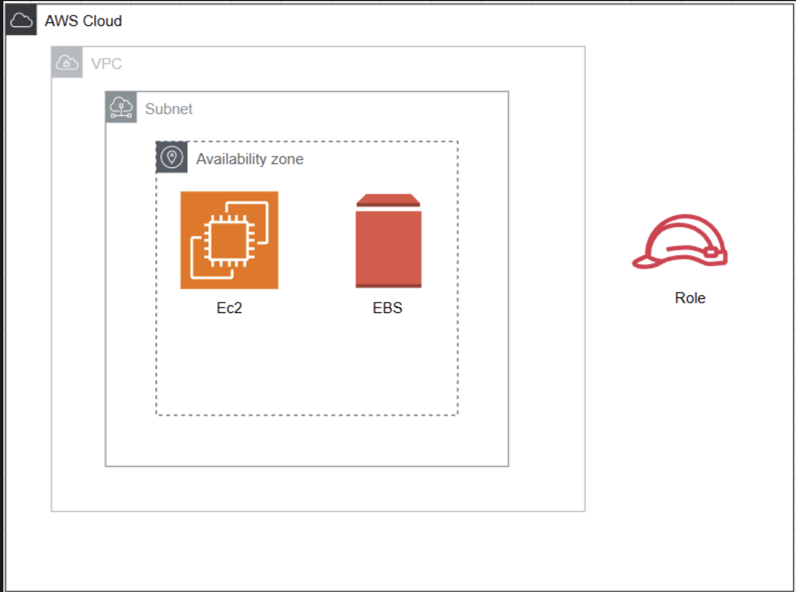
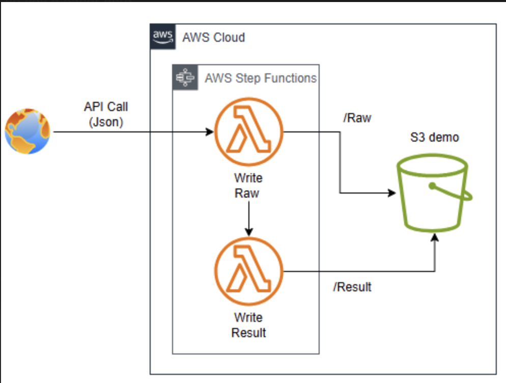

# Demos de Infraestructura como Código usando AWS CloudFormation

Este repositorio contiene una serie de demos básicas que ilustran cómo desplegar infraestructura como código utilizando AWS CloudFormation. Cada demo ofrece ejemplos prácticos para facilitar el aprendizaje y la puesta en marcha de soluciones en AWS.

## Contenido del Proyecto

- **Demo 1: [EC2-Lambda-StepFunction]**  
  Breve descripción de lo que se despliega en esta demo.


> 

> 

## Requisitos Previos

Antes de desplegar las demos, asegúrate de contar con lo siguiente:

- [AWS CLI](https://aws.amazon.com/cli/) instalado y configurado con las credenciales de tu cuenta AWS.
- Acceso a una cuenta de AWS.
- Conocimientos básicos sobre AWS CloudFormation y los servicios de AWS.
- [Git](https://git-scm.com/) para clonar el repositorio.

## Uso

1. **Clona el repositorio:**
   ```bash
   git clone https://github.com/data-clouders/Demos_basic.git
   cd nombre_del_repositorio
